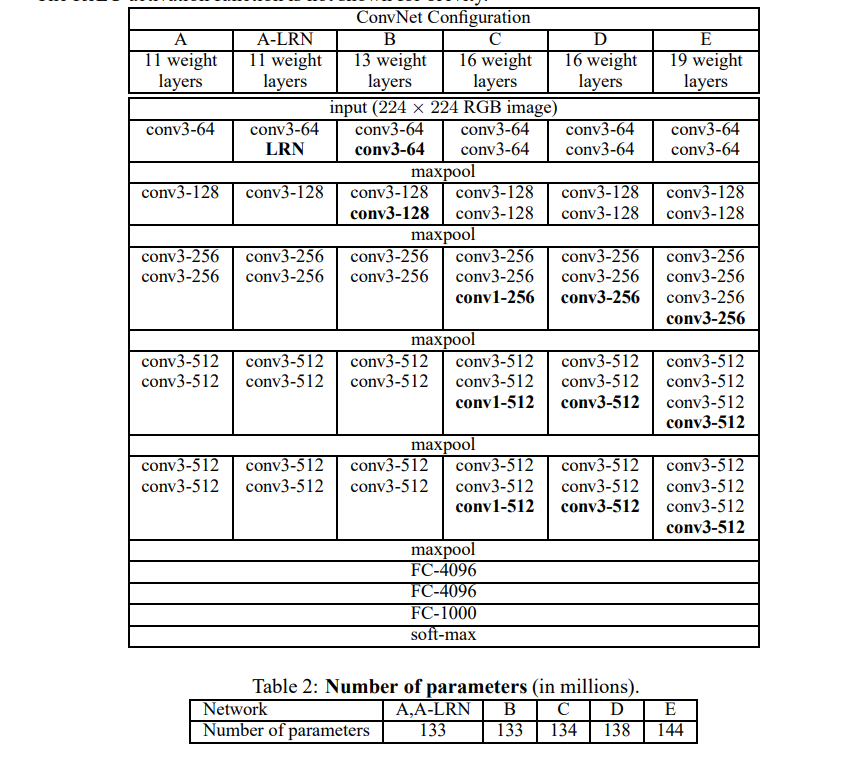
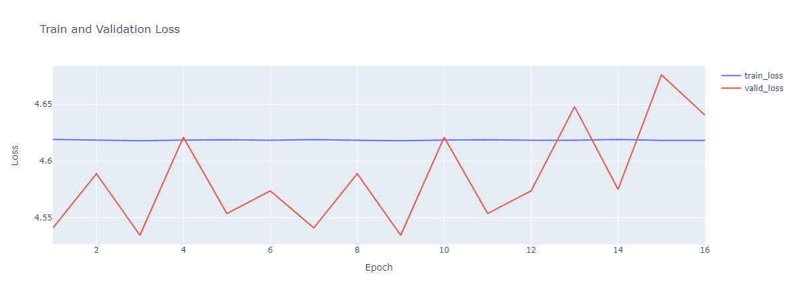

# VGGNet Implementation with PyTorch

This repository contains an implementation of the VGGNet architecture from scratch using PyTorch. 

VGGNet is a deep convolutional neural network proposed by K. Simonyan and A. Zisserman from the University of Oxford in the paper [Very Deep Convolutional Networks for Large-Scale Image Recognition](https://arxiv.org/abs/1409.1556). The model achieves remarkable accuracy on image recognition tasks and is characterized by its uniform use of convolution layers with small filter sizes.

# VGGNet Architecture

1. *Input Layer*: The input layer of VGG-16 accepts images of fixed size, typically 224x224 pixels with three color channels (RGB).

2. *Convolutional Layers*: The core building blocks of the VGGNet are convolutional layers. They use filters or kernels (usually of size 3x3 with a stride of 1) to extract features from the input image or preceding feature maps. In VGG-16, there are 13 convolutional layers. They are arranged in blocks, with each block followed by a max-pooling layer. The number of filters in these layers increases as the network goes deeper, typically doubling after each max-pooling layer, starting from 64 in the first layer to 512 in the deeper layers.

3. *Activation Function (ReLU)*: After each convolutional layer, a Rectified Linear Unit (ReLU) activation function is applied to introduce non-linearity into the model, allowing it to learn complex patterns.

4. *Pooling Layers (Max-Pooling)*: VGGNet uses max-pooling layers after each block of convolutional layers. These layers are applied with a 2x2 filter and a stride of 2, reducing the dimensionality of the feature maps by half. This downsampling helps reduce the computation and also helps in making the model translation-invariant.

5. *Fully Connected Layers*: After all the convolutional and max-pooling layers, VGGNet flattens the final feature maps and passes them through three fully connected layers. The first two have 4096 channels each, and the third has 1000 channels (one for each class in the ImageNet challenge for which VGGNet was originally designed). Each fully connected layer is followed by a ReLU activation function.

6. *Softmax Layer*: The final layer is a softmax layer that outputs a distribution over the 1000 class labels, converting the scores into probabilities.

7. *Dropout*: During training, dropout is applied after the first two fully connected layers. This means randomly selected neurons are ignored during training, reducing the risk of overfitting.

# Implementation Details

We use the CIFAR 100 datasets for training the model.

The main implementation of the VGGNet model can be found in the model.py file. The function build_model() in this file constructs a VGG model based on the provided architecture name, number of classes, and other parameters. The model is then moved to the specified device (CPU or GPU).

The training code for the model is located in train_code.py. 

The results/ directory contains the logs and trained models.

# Results

Due to the lack of resources I was able to run the model only for 16 epochs which is not enough to test the model. In the future, I plan on running the model for more epochs so as to get more better and reporducible results.

Here is the training loss vs validation loss curve for different epochs:

Future Modifications
Future modifications to this project may include implementing other variants of the VGGNet architecture, such as VGG16 and VGG19. Additionally, improvements can be made in the training code to include more sophisticated techniques for improving model performance, such as learning rate scheduling and data augmentation.